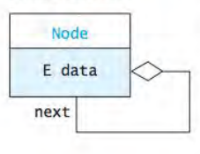
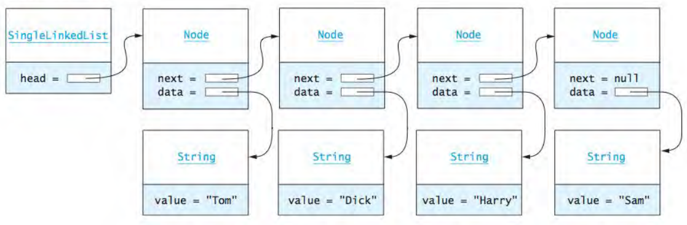

# Linked Lists

- A linked list is a data structure that provides us with the ability to add or remove items anywhere 
in the list in constant `O(1)` time.
- A linked list is useful when we need to insert or remove elements at random locations.
- A linked is also useful when we need to do insertion and deletion frequently.
- We do not keep track of indices inside a linked list, hence we cannot tell the order of a node just by looking at it.

___

## Terminologies

- Head : The first node of a linked list.
- Tail : The last node of a linked list.
- Link Hopping/Node Hopping/Pointer Hopping: Moving from one node to another by following a `next` reference.

___

## Types of Linked Lists

1. Singly Linked List

    - The tail of a `singly` linked list will contain `null`.  
    **LIMITATION**
    - Insertion at the front of the list is `O(1)`. Insertion at other positions is `O(n)`, where `n` is
the size of the list.
    
    
2. Doubly Linked List

    - A `Doubly` linked list allows us to go in both direction, `forward` and `backward`.

3. Circular Linked List

    - There is no `head` or `tail` in a `circular` linked list.
    - Instead of having the last node's next pointer be `null`, it points back to the first node.
    
___

## A Node 



- A `Node` is a data structure that contains a data item and one or more links.
- A `linl` is a reference to a `node`.

Sample code for implementing a `node` in a Singly Linked List in Java

```java
public class Node {
    private int data;
    private Node next;
  
    public int getData() {
      return data;
    }
  
    public void setData(int data) {
      this.data = data;
    }
  
    public Node getNext() {
      return next;
    }
  
    public void setNext(Node next) {
      this.next = next;
    }
  
    public Node(int data, Node next) {
      this.data = data;
      this.next = next;
    }
} 
```

___

## The Linked List of Nodes


___

## Help Links

1. [Visualize Linked Lists](https://visualgo.net/en/list)